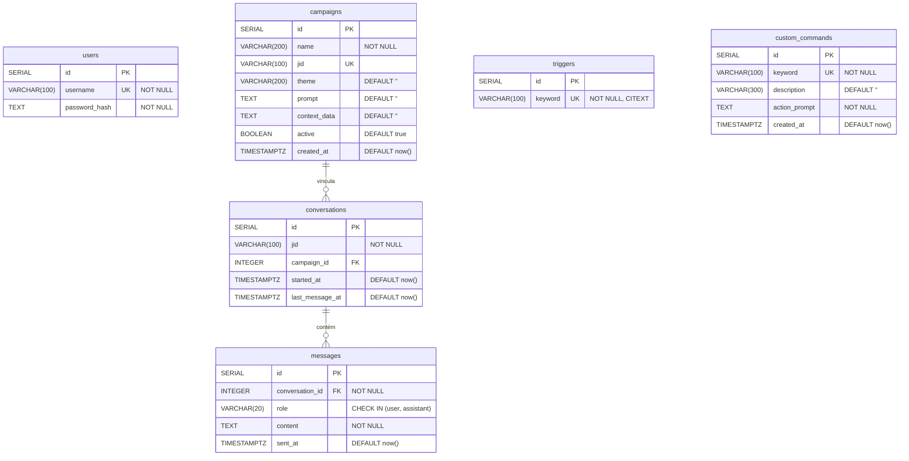

# DER — Diagrama Entidade-Relacionamento

Bot RPG WhatsApp — Banco de Dados

## Descrição das Entidades

| Tabela | Descrição |
|--------|-----------|
| `users` | Usuários do painel admin (autenticação JWT) |
| `campaigns` | Campanhas de RPG — cada uma vinculada a um grupo WhatsApp via JID |
| `triggers` | Palavras-chave monitoradas pelo bot (ex: `!acao`, `!mestre`) |
| `custom_commands` | Comandos personalizados com prompt de IA e suporte a `{{text}}` |
| `conversations` | Sessões de conversa por JID, opcionalmente vinculadas a uma campanha |
| `messages` | Mensagens individuais de cada conversa (role: `user` ou `assistant`) |

## Relacionamentos

- `campaigns` → `conversations`: uma campanha pode ter muitas conversas (1:N)
- `conversations` → `messages`: uma conversa contém muitas mensagens (1:N)
- `triggers` e `custom_commands` são independentes (sem FK)
